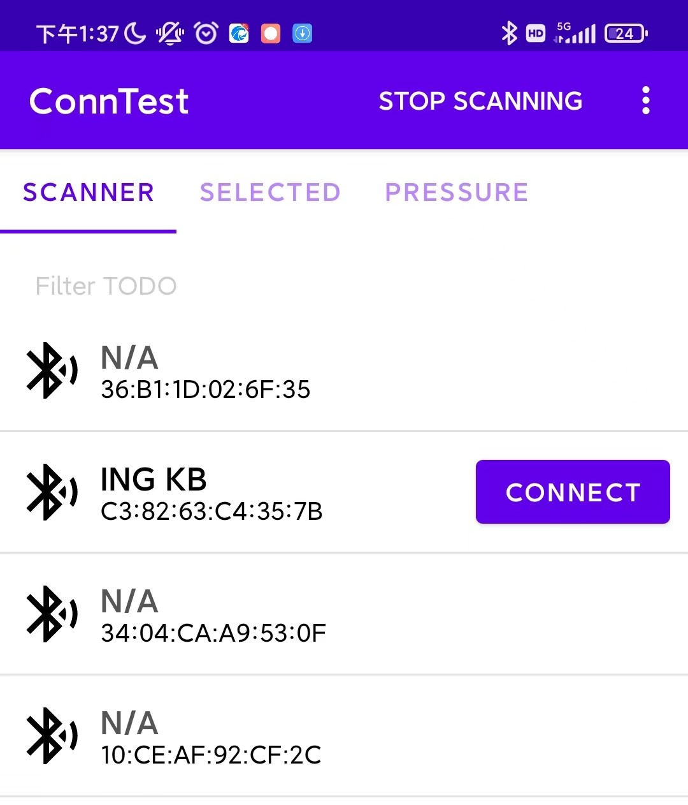
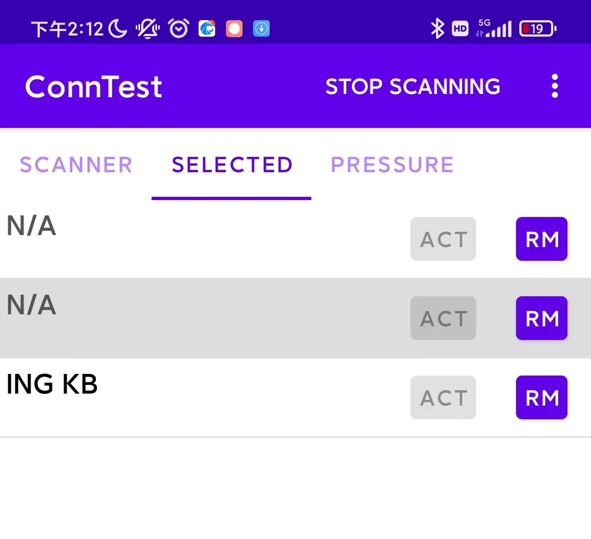
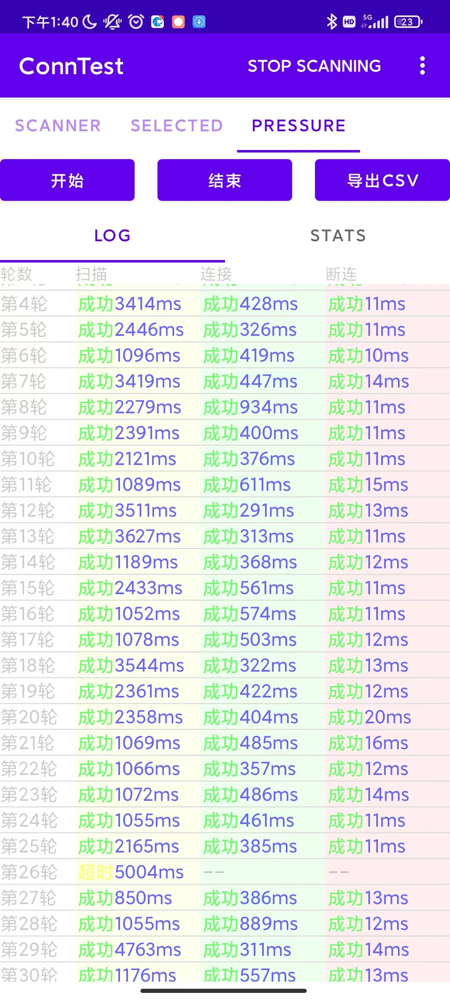
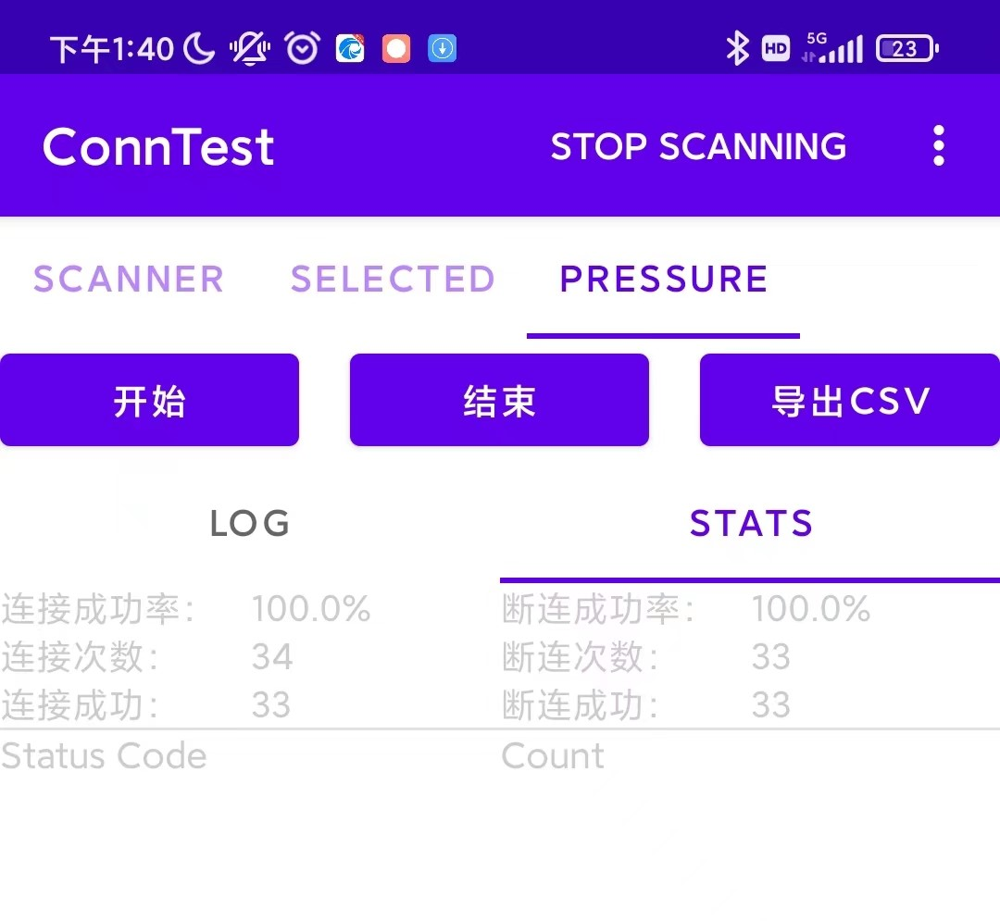
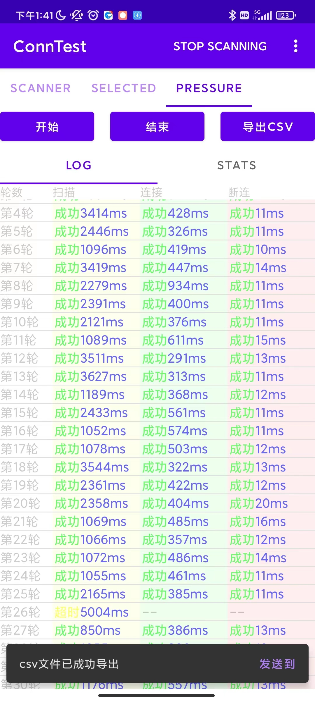

# app-conntest-android
connection test app for Android

主要包括三个界面

1. 扫描面板
2. 已选设备面板
3. 连接测试面板
   - LOG面板
   - STATS面板

### 使用APP进行连接测试

1. 扫描设备
2. 选择设备
3. 开始连接测试
4. 导出连接测试结果

#### 扫描设备

点击标题栏右侧的SCAN按钮，APP会调用Android的蓝牙适配器进行设备发现，发现的设备会在扫描面板中列出，点击标题栏右侧的STOP SCANNING则停止。

#### 选择设备

在扫描面板中点击设备信息右侧的CONNECT按钮，设备会添加到已选设备面板，可添加多个设备到已选设备面板，但压力测试数据只会对应已选设备面板中选中的设备。

#### 开始连接测试

在连接测试面板中点击Start按钮就会开始，连接测试的过程是重复对同一设备进行扫描、连接和断连三个步骤，一轮结束后马上开始下一轮，每一步骤的结果和耗时都会显示在LOG面板的数据表格中，如果连接和断连出现异常情况，则会将异常码以16进制的形式显示在数据表格中，另外还有连接成功率异常码统计数据在STATS面板

#### 导出连接测试结果

连接测试的过程中可以随时点击导出CSV按钮将数据表格导出成.csv格式文件，文件默认位置在/storage/emulated/0/conn_test.csv。

文件生成完毕后APP底部会弹出提示csv文件已成功导出，并且右侧会出现“发送到”按钮，点击“发送到”按钮可以将生成的文件直接发送到微信

#### 注意事项

1. 必须先选择设备才能开始连接测试

2. APP需要蓝牙权限，文件导出功能需要存储权限
